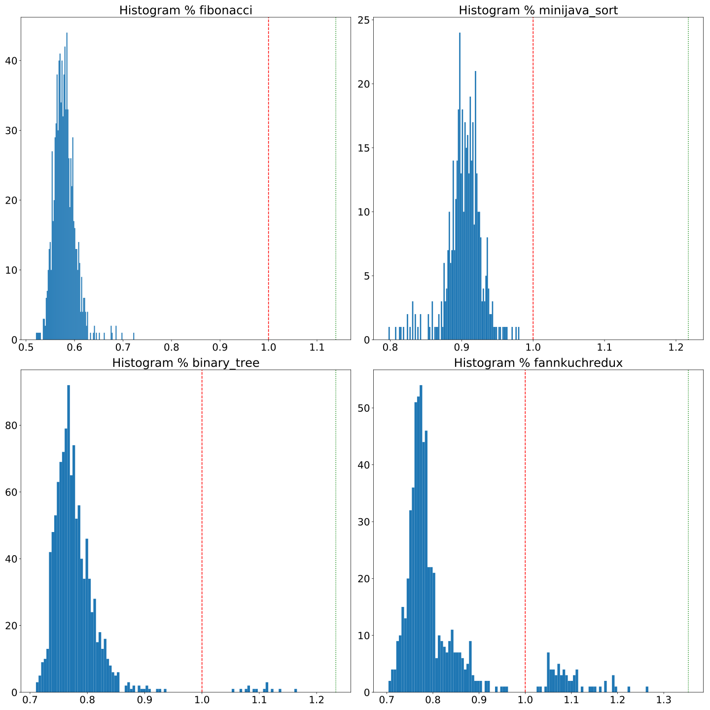
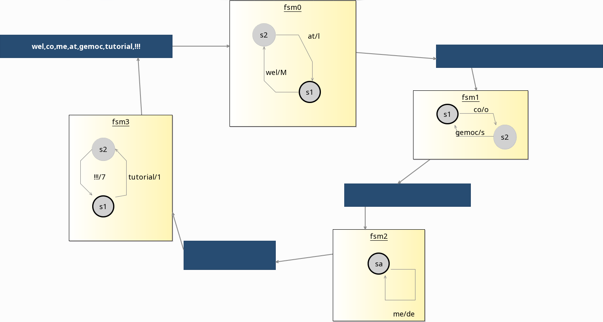

---
# Feel free to add content and custom Front Matter to this file.
# To modify the layout, see https://jekyllrb.com/docs/themes/#overriding-theme-defaults

layout: page
---

<script type="text/javascript" async src="https://cdnjs.cloudflare.com/ajax/libs/mathjax/2.7.6/MathJax.js?config=TeX-MML-AM_CHTML"></script>
<style>
.texttt {
	font-style: oblique;
}
.wrapper {
	text-align: justify;
	text-justify: inter-word;
}

pre.highlight {
  white-space: pre-wrap;
  font-size: 13px;
}

.mjx-math, code {
  font-size: 16px;
}

.wrapper {
  max-width: calc(1024px - (30px));
}
</style>

# Truffle-Based Systematic Optimizations of DSL Interpreters
{:.no_toc} 

This companion webpage presents complementary details to support the ECMFA'20 paper.
The [Abstract](#abstract) below reminds the contribution of the paper.
Section [Automated feature selection](#automated-feature-selection) presents the details of our approach to aggregate data about the impact of the <span class="texttt">dispatch</span> optimization on the interpreters performances.
Then, [System of finite state machines example](#system-of-finite-state-machines-example) presents the programs used for the execution of the system of finite state machine language.
Finally, [Polymorphic Inline Cache implementation](#polymorphic-inline-cache-implementation) presents a sample of the code produced by the compiler when a <span class="texttt">dispatch</span> optimization is introduced in the ALE semantics.

<nav>
* hello
{:toc}
</nav>

## Abstract

Numerous language workbenches have been proposed over the past decade to ease the definition of Domain-Specific Languages (DSLs).
Language workbenches enable language designers to specify DSLs using high-level metalanguages and to generate their implementation (e.g., parsers, interpreters, editors) automatically.
However, little attention has been given to the performance of the resulting interpreters.
In many domains where performance is key (e.g., scientific and high-performance computing), this forces language designers to handcraft ad-hoc optimizations in the generated interpreters code.

In this paper, we propose to systematically exploit the information contained in language specifications to derive optimized Truffle-based language interpreters executed over the GraalVM.
We implement our approach on top of the Eclipse Modeling Framework (EMF) by complementing its existing compilation chain with Truffle-specific information which drives the GraalVM to benefit from optimized just-in-time compilation.
A key benefit of our approach is that it leverages existing language specifications and does not require additional information from language designers who remain oblivious of Truffle's low-level intricacies.

We evaluate our approach using a representative set of four DSLs and eight conforming programs.
Compared to the standard interpreters generated by EMF running on the Graal VM, we observe an average speed-up of x1.22, ranging from x1.05 to x1.69.
Although the benefits vary slightly from one DSL or program to another, we conclude that our approach yields significant performance gains while remaining non-intrusive of EMF abstractions.

## Automated feature selection

Node, <span class="texttt">@Child</span> and <span class="texttt">@Children</span> annotations code generation are guided by the structural definition of the language and are not subject to specific choices in the compiler.
The placement of Truffle boundaries, is driven by the need to isolate the interpreter from Java source code and is specifically defined to be compatible with the partial evaluation process of Truffle, as explained in the paper.
However, while the implementation of the polymorphic inline cache is abstracted through the <span class="texttt">dispatch</span> keyword, it is still up to the developper to make a performance-related choice on the introduction of the keyword on the relevant methods.

As the <span class="texttt">dispatch</span> keyword can be placed independently on each method without constraint, given $$N$$ the number of methods defined in an ALE interpreter, the number of valid combinations is $$2^N$$.
For instance, the MiniJava implementation is composed of 73 methods, consequently exploring the space exhaustively would mean $$2^{73} \approx 9.44\times10^{21}$$ combinations of <span class="texttt">dispatch</span>.

To address this challenge we tried to identify fast interpreters using a genetic algorithm based approach.
Genetic algorithms are evolutionary algorithms inspired by the process of natural selection and are commonly applied to optimization problems.
Here we applied this technique to the search of the best configuration to obtain fast interpreters.

We based our implementation on the Jenetics[^1] java library that provides a framework for the implementation of genetic algorithms.
A genetic algorithm works by evolving an initial random set of configurations, called a population, over time.
Each configuration on a population is called an individual, and each variable part of an individual is called a gene.

The algorithm selects and mutates the current population in order to form a new population that is more fitted to answer the targeted problem.
The fitness of the individuals is obtained by applying a fitness function to each individual of the population.
A fitness function is a java method that takes an individual as an input, and returns a comparable (i.e., total ordering) value that represents its fitness.
In our case, the fitness function compiles an interpreter according to the individual genes and runs the benchmarks.
The average measured time is then returned.
From the fitness score of each individual, a new population is computed.
This population is composed of 60% of individuals from the previous population (i.e., survivors), and 40% of new individuals (i.e., offspring).
Survivors are selected through a tournament selection, where three random individuals are selected from the population, and only the best fitted is kept for the next generation. 
This operation is repeated until the number of survivors is reached.
The offspring are selected in the same way, but instead of being added to the population as-is, they are altered by two operations.
First, a single-point crossover is applied. This operation consist of the random selection of two offsprings, and mixing their genomes by random selection of a slicing point.
For instance from the slicing of two individuals $$a$$ and $$b$$ at index $$m$$, we obtain the following four sets $$\{a_{0}...a_{m}\},\{a_{m+1}...a_{n}\}={slice}_m(\{a_{0}...a_{n}\})$$ and $$\{b_{0}...b_{m}\},\{b_{m+1}...b_{n}\}={slice}_m\{b_{0}...b_{n}\})$$.
Those sets are recombined to form two new individuals $${\{a_{0}...a_{m},b_{m+1}...b_{n}\}}$$ and $${\{b_{0}...b_{m},a_{m+1}...a_{n}\}}$$ 
Finally, a random mutation is applied, on each gene with a probability of 15%.
The fitness function is configured to minimize the fitness value, in order to converge to the configuration that leads to the fastest interpreters.

The figure below presents the result of the application of the genetic algorithm presented above to the four programs of the MiniJava language.
All the measured times observed during the execution of the genetic algorithm are included in the histograms, 400 individuals have been generated during the evaluation of each program.
The red dashed vertical line represents the baseline (i.e., the Truffle-less version executed on Graal VM) and the green dotted vertical line represents the relative execution time of the Truffle-less version executed on Hotspot VM.
We can observe a Gaussian-like distribution of the measured times.
Since the exploration strategy is biased towards faster interpreters, most of the measures are faster than the baselines, but we can still observe that some mutations lead to slow results.

<div style="text-align: center;">
<i>
Histogram of the execution times of the programs relatively to the baselines. The red dashed line represents the average execution time of the program on a Truffle-less implementation in the GraalVM JVM. The green dotted line represents the average execution time of the same Truffle-less implementation on the Hotspot JVM, relatively to the GraalVM JVM execution time.
</i>
</div>


Through this approach we are able to identify fast combinations of <span class="texttt">dispatch</span> use in the interpreter for each program.
While this approach is relevant to quickly specialize the interpreter for a single program, generalizing the approach to find a universal fastest interpreter over all programs is left as future work.

The raw data are also available:
- Python datastructure of the measurements: [raw_data.py](raw_data.py)
- Python Notebook with the figures generation logic: [notebook.ipynb](notebook.ipynb)

[^1]: Jenetics: [http://jenetics.io/](http://jenetics.io/)

## System of finite state machines example

The figure below presents a program in the System of FSM language.
The system is composed of four FSMs, numerated from $${fsm}_0$$ to $${fsm}_3$$ and four buffers, represented by blue squares in the figure and numerate from $$b_0$$ to $$b_3$$.
Each FSM $${fsm}_n$$ is connected to an incoming buffer $$b_{n-1}$$ and an outgoing buffer $$b_{n+1}$$, forming a ring of communicating FSMs.
FSM are composed of states connected by transitions.
A transition has two string values: a trigger and an action, represented by two string concatenated with a slash (i.e., <span style="texttt">'trigger/action'</span>) next to the transition arrow.

During the execution, an FSM with at least a value in its incoming buffer removes the first value from the buffer and consumes it.
First the finite state machine check if the incoming value match the trigger of an outgoing transition of the current state.
If no transition is found, the incoming value is directly pushed into the outgoing buffer.
Otherwise, the value is consumed, the current state is set to the outgoing state of the transition, and the action of the transition is pushed into the outgoing buffer.
This process repeats until all the buffers are empty.

<!--\begin{figure}
	\centering
	\caption{Benchmarked system of finite state machines}
	\label{fig:model-finite-state-machines}
	\setlength{\unitlength}{.01in}%{.025in}
	\includegraphics[width=\columnwidth]{figures/}
\end{figure}-->
<div style="text-align: center;">
<i>
System of finite state machines.
</i>
</div>


## Polymorphic Inline Cache implementation

The figure below presents an extract of the compilation of a <span style="texttt">dispatch</span> optimization on the <span style="texttt">evaluateStatement</span> method of the <span style="texttt">Statement</span> class, and a call to <span style="texttt">evaluateStatement</span> from the <span style="texttt">Block</span> class.


<!--% basicstyle=\ttfamily\tiny,numberstyle=\tiny\color{LightGrey}
\begin{lstlisting}[language=Java,label=lst:pil-impl,caption={Implementation of the Polymorphic Inline Cache on the execute method of a Statement class at a call from the Block class.}]-->
```java
class StatementDispatchWrapper {
 RootCallTarget callTarget;

 StatementDispatch(Statement it) {
  this.callTarget = Truffle.getRuntime().createCallTarget(new StatementRootNode(it));
 }

 RootCallTarget getCallTarget() {
  return callTarget;
 }
}

class StatementRootNode extends RootNode {
 @Child Statement it;

 StatementRootNode(Statement it) {
  this.it = it;
 }

 @Override
 Object execute(VirtualFrame frame) {
  State state = (miniJava.interpreter.miniJava.State) frame.getArguments()[0];
  it.evaluateStatement(state);
  return null;
 }
}

abstract class StatementDispatch extends Node {
 static final int INLINE_CACHE_SIZE = 3;

 abstract Object executeDispatch(Object function, Object[] arguments);

 @Specialization(limit = "INLINE_CACHE_SIZE", guards = "function.getCallTarget() == cachedTarget")
 static Object doDirect(StatementDispatchWrapper
  function, Object[] arguments, @Cached("function.getCallTarget()") RootCallTarget cachedTarget, @Cached("create(cachedTarget)") DirectCallNode callNode) {
  return callNode.call(arguments);
 }

 @Specialization(replaces = "doDirect")
 static Object doIndirect(StatementDispatchWrapper
  function, Object[] arguments, @Cached("create()") IndirectCallNode callNode) {
  return callNode.call(function.getCallTarget(), arguments);
 }
}

@NodeInfo(description = "Statement")
class Statement extends Node {
 @CompilationFinal StatementDispatchWrapper cached;

 StatementImpl() {
  this.cached = new StatementDispatchWrapper(this);
 }
 
 abstract void evaluateStatement(State state);

 StatementDispatchWrapper getCached() {
  return this.cached;
 }

 // ...
}

@NodeInfo(description = "Block")
class Block extends Statement {
 EList < Statement > statements;
 @Children Statement[] statementsArr;
 @Child StatementDispatch dispatchStatement;

 BlockImpl() {
  this.dispatchStatement = StatementDispatchNodeGen.create();
 }

 void evaluateStatementKeepContext(State state) {
  // ...
  state.pushNewContext();
  Frame currentFrame = state.findCurrentFrame();
  int lgt = CollectionService.size(this.statementsArr);
  int i = 0;
  while (i < lgt) {
   Statement stmt = this.statementsArr[i];
   dispatchStatementEvaluateStatement.executeDispatch(stmt.getCached(), new Object[] {
    state
   });
   i++;
  }
 }

 // ...
}
```

<!--\begin{lstlisting}[language=Java,label=lst:pil-truffle-gen,caption={Concrete StatementDispatch class derived from the StatementDispatch annotation.}]-->
```java
@GeneratedBy(StatementDispatch.class)
public final class StatementDispatchNodeGen extends StatementDispatch {

 @CompilationFinal private int state_;
 @CompilationFinal private int exclude_;
 @Child private DirectData direct_cache;
 @Child private IndirectCallNode indirect_callNode_;

 @ExplodeLoop(kind = LoopExplosionKind.FULL_EXPLODE_UNTIL_RETURN)
 @Override
 public Object executeDispatch(Object arg0Value, Object[] arg1Value) {
  int state = state_;
  if (state != 0 /* is-active doDirect(StatementDispatchWrapper, Object[], RootCallTarget, DirectCallNode) || doIndirect(StatementDispatchWrapper, Object[], IndirectCallNode) */ && arg0Value instanceof StatementDispatchWrapper) {
   StatementDispatchWrapper arg0Value_ = (StatementDispatchWrapper) arg0Value;
   if ((state & 0b1) != 0 /* is-active doDirect(StatementDispatchWrapper, Object[], RootCallTarget, DirectCallNode) */ ) {
    DirectData s1_ = this.direct_cache;
    while (s1_ != null) {
     if ((arg0Value_.getCallTarget() == s1_.cachedTarget_)) {
      return StatementDispatch.doDirect(arg0Value_, arg1Value, s1_.cachedTarget_, s1_.callNode_);
     }
     s1_ = s1_.next_;
    }
   }
   if ((state & 0b10) != 0 /* is-active doIndirect(StatementDispatchWrapper, Object[], IndirectCallNode) */ ) {
    return StatementDispatch.doIndirect(arg0Value_, arg1Value, this.indirect_callNode_);
   }
  }
  CompilerDirectives.transferToInterpreterAndInvalidate();
  return executeAndSpecialize(arg0Value, arg1Value);
 }

 private Object executeAndSpecialize(Object arg0Value, Object[] arg1Value) {
  Lock lock = getLock();
  boolean hasLock = true;
  lock.lock();
  int state = state_;
  int exclude = exclude_;
  try {
   if (arg0Value instanceof StatementDispatchWrapper) {
    StatementDispatchWrapper arg0Value_ = (StatementDispatchWrapper) arg0Value;
    if ((exclude) == 0 /* is-not-excluded doDirect(StatementDispatchWrapper, Object[], RootCallTarget, DirectCallNode) */ ) {
     int count1_ = 0;
     DirectData s1_ = this.direct_cache;
     if ((state & 0b1) != 0 /* is-active doDirect(StatementDispatchWrapper, Object[], RootCallTarget, DirectCallNode) */ ) {
      while (s1_ != null) {
       if ((arg0Value_.getCallTarget() == s1_.cachedTarget_)) {
        break;
       }
       s1_ = s1_.next_;
       count1_++;
      }
     }
     if (s1_ == null) {
      {
       RootCallTarget cachedTarget__ = (arg0Value_.getCallTarget());
       if ((arg0Value_.getCallTarget() == cachedTarget__) && count1_ < (StatementDispatch.INLINE_CACHE_SIZE)) {
        s1_ = new DirectData(direct_cache);
        s1_.cachedTarget_ = cachedTarget__;
        s1_.callNode_ = (DirectCallNode.create(cachedTarget__));
        this.direct_cache = super.insert(s1_);
        this.state_ = state = state | 0b1 /* add-active doDirect(StatementDispatchWrapper, Object[], RootCallTarget, DirectCallNode) */ ;
       }
      }
     }
     if (s1_ != null) {
      lock.unlock();
      hasLock = false;
      return StatementDispatch.doDirect(arg0Value_, arg1Value, s1_.cachedTarget_, s1_.callNode_);
     }
    }
    this.indirect_callNode_ = super.insert((IndirectCallNode.create()));
    this.exclude_ = exclude = exclude | 0b1 /* add-excluded doDirect(StatementDispatchWrapper, Object[], RootCallTarget, DirectCallNode) */ ;
    this.direct_cache = null;
    state = state & 0xfffffffe /* remove-active doDirect(StatementDispatchWrapper, Object[], RootCallTarget, DirectCallNode) */ ;
    this.state_ = state = state | 0b10 /* add-active doIndirect(StatementDispatchWrapper, Object[], IndirectCallNode) */ ;
    lock.unlock();
    hasLock = false;
    return StatementDispatch.doIndirect(arg0Value_, arg1Value, this.indirect_callNode_);
   }
   CompilerDirectives.transferToInterpreterAndInvalidate();
   throw new UnsupportedSpecializationException(this, new Node[] {
    null,
    null
   }, arg0Value, arg1Value);
  } finally {
   if (hasLock) {
    lock.unlock();
   }
  }
 }

 @Override
 public NodeCost getCost() {
  int state = state_;
  if (state == 0b0) {
   return NodeCost.UNINITIALIZED;
  } else if ((state & (state - 1)) == 0 /* is-single-active  */ ) {
   DirectData s1_ = this.direct_cache;
   if ((s1_ == null || s1_.next_ == null)) {
    return NodeCost.MONOMORPHIC;
   }
  }
  return NodeCost.POLYMORPHIC;
 }

 public static StatementDispatch create() {
  return new StatementDispatchNodeGen();
 }

 @GeneratedBy(StatementDispatch.class)
 private static final class DirectData extends Node {

  @Child DirectData next_;
  @CompilationFinal RootCallTarget cachedTarget_;
  @Child DirectCallNode callNode_;

  DirectData(DirectData next_) {
   this.next_ = next_;
  }

  @Override
  public NodeCost getCost() {
   return NodeCost.NONE;
  }

 }
}
```